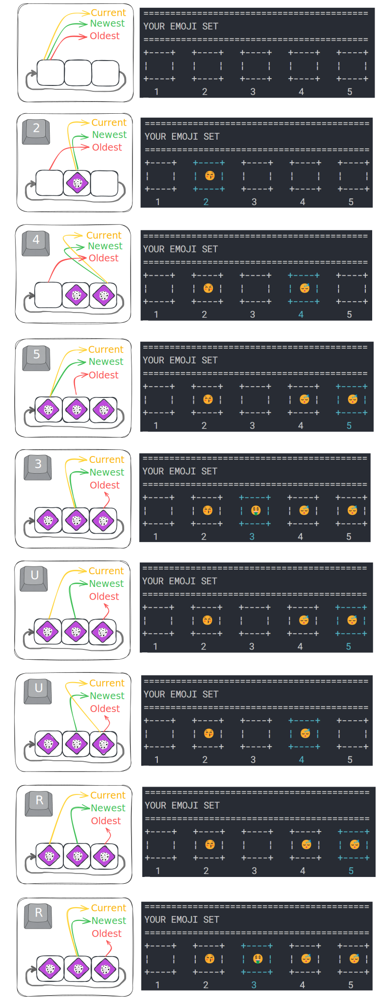

## Undo/Redo Buffer

<table>
<tr>
    <td style="background-color:#7CB9E8; color:#00008B">Application type</td>
    <td>Console</td>
</tr>
<tr>
    <td style="background-color:#7CB9E8; color:#00008B">Stack</td>
    <td>.NET 8</td>
</tr>
<tr>
    <td style="background-color:#7CB9E8; color:#00008B">Key concepts explored</td>
    <td>
        - Ring buffer 
        - Unmanaged Memory 
        - Array, Array 2D
    </td>
</tr>
</table>

### Description

The user manages a set of emojis, with undo/redo functionality provided by a ring buffer.

How to perform modifications:

- Press a slot number to place a random emoji in that slot.
- Press a slot number again to empty the slot.
- Press the 'F' key to flip the entire set.

How to undo/redo modifications:

- Press 'U' to undo the last modification.
- Press 'R' to redo the last undone modification.

### Buffer behaviour

The ring buffer allows to store the user actions.

---------------------------------------------------------------------

TO DO:
- Print alerts:
    Cannot undo: "No more previous changes were found in the buffer."
    Cannot redo: "No more forward changes were found in the buffer."